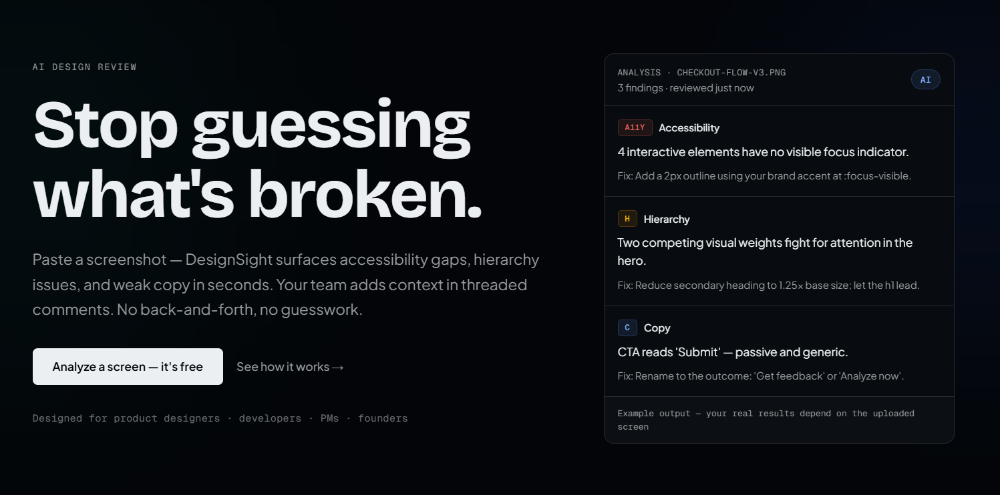
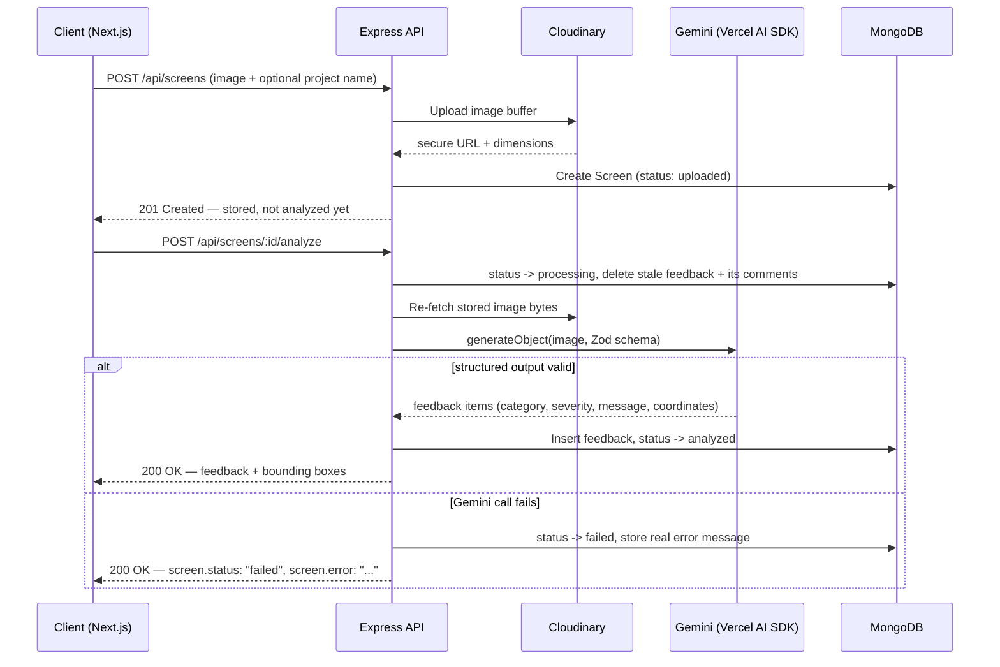
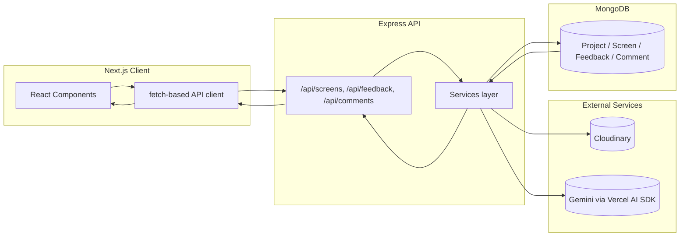

# DesignSight — AI Design Feedback, Anchored to Real Screen Coordinates

**A Turborepo monorepo for uploading a screenshot, getting structured AI feedback anchored to exact regions of the image, and collaborating on it with threaded comments — no account required.**

[🚀 Live Demo](https://design-sight-frontend.vercel.app/)




---

## 1. What This Solves

Most "AI design review" tools fall into one of two traps: the AI's output is loosely-structured free text you have to manually map onto the screenshot yourself ("the button in the corner" — which corner?), or every test upload silently triggers a paid AI call, so you can't experiment without a running cost.

DesignSight is built to avoid both:

- **Every feedback item has a real, validated shape.** Category, severity, and a normalized bounding box are enforced by a Zod schema at the point the Gemini call is made — not inferred afterward by parsing free text.
- **Upload and Analyze are two separate actions.** Storing a screenshot never costs anything; the actual Gemini call only happens when you explicitly trigger it.
- **Coordinates are one consistent unit everywhere.** Normalized 0–1 fractions of the image — in the database, the API, and the frontend — converted to pixels only at render time, using whatever size the image is actually rendered at.

### What that gets you in practice

- A "couldn't parse the AI response" bug class doesn't exist: either the model's output validates against the schema, or the screen is explicitly marked `failed` with the real error message — never a silently empty feedback list.
- You can upload a dozen test screenshots without spending a cent on inference, then choose exactly which ones to actually analyze.
- Bounding boxes stay accurate whether you're viewing on a phone or a wide monitor, because they're computed from the rendered image size, not a fixed resolution.
- Re-analyzing a screen (a retry, or an intentional re-run) replaces its feedback set atomically and cascade-deletes the comments tied to the old feedback items — it never leaves orphaned rows nothing can reach again.
- `GET /api/screens/:id?role=developer` and `GET /api/screens/:id?role=designer` genuinely return different feedback subsets — the role-filtering logic is verifiable with curl, not just by clicking through the UI.
- No accounts, but not anonymous chaos either: a name and role are set once per browser and carried into every comment you post, and any screen is shareable via its own URL — no login wall to view or comment on it.

## 2. Architecture

### Stack

| Layer | Technology |
|---|---|
| **Frontend** | Next.js 15 (App Router), React 19, TypeScript, Tailwind CSS v4, shadcn/ui (Radix primitives), Framer Motion, Sonner (toasts) |
| **AI** | Google Gemini (`gemini-3.5-flash`) via the Vercel AI SDK (`ai` + `@ai-sdk/google`), structured output enforced with Zod |
| **Backend** | Node.js, Express 5, `tsx` for local dev, `tsc` for production builds |
| **Database** | MongoDB via Mongoose 8 |
| **Storage** | Cloudinary (screenshot hosting) |
| **Monorepo** | Turborepo + npm workspaces — shared `packages/shared` (role-filter logic, shared types), plus `packages/eslint-config`, `packages/typescript-config` |
| **Client transport** | Plain `fetch`-based API client — no extra HTTP library |

### How a screen moves through the system





## 3. Running It Locally

### You'll need

| Requirement | Version |
|---|---|
| Node.js | 20 or newer |
| npm | 11.x |
| MongoDB | Local install or a free Atlas cluster |
| Google AI Studio API key | Gemini — see [Cost Estimates](#4-ai-provider--cost-estimates) below |
| Cloudinary account | Free tier |

### Install

```bash
git clone https://github.com/ankitku3101/DesignSight.git designsight
cd designsight
npm install

cp apps/backend/.env.example apps/backend/.env
cp apps/frontend/.env.example apps/frontend/.env
```

Fill in the copied `.env` files with your own Gemini and Cloudinary credentials, then point `MONGO_URI` at a local Mongo instance or an Atlas cluster.

### Run both apps together (recommended)

```bash
npm run dev
```

### Or run them separately

```bash
# Backend — Express API on :5000
cd apps/backend
npm run dev

# Frontend — Next.js on :3000
cd apps/frontend
npm run dev
```

### Build for production

```bash
npm run build

cd apps/backend && npm start     # node dist/index.js
cd apps/frontend && npm start    # next start
```

### `apps/backend/.env.example`

```bash
MONGO_URI=mongodb://localhost:27017/designsight
PORT=5000
CORS_ORIGIN=http://localhost:3000
GEMINI_API_KEY=
GEMINI_MODEL=gemini-3.5-flash
CLOUDINARY_CLOUD_NAME=
CLOUDINARY_API_KEY=
CLOUDINARY_API_SECRET=
```

### `apps/frontend/.env.example`

```bash
NEXT_PUBLIC_BE_URL=http://localhost:5000
```

## 4. AI Provider & Cost Estimates

**Google Gemini** (`gemini-3.5-flash`, via [Google AI Studio](https://aistudio.google.com/apikey))

- As of March 2026, Google requires new AI Studio accounts to enable **Prepay billing** (a card on file with a small balance) before the Gemini API will serve *any* requests — including free-tier-rate usage. The old "$300 welcome credit" also no longer covers Gemini API usage for accounts created after March 2, 2026. Budget for this before you start: a $5–10 prepay balance comfortably covers heavy development use.
- Per-request cost is genuinely small at this model tier: `gemini-3.5-flash` is priced at **$1.50 / 1M input tokens** (an uploaded screenshot counts as multimodal input, billed at the same rate as text) and **$9.00 / 1M output tokens** (the structured JSON feedback).
- A single screen analysis (one image + prompt in, one JSON array of 4–10 feedback items out) is roughly **1,500–2,500 input tokens** and **300–800 output tokens** — call it **$0.005–$0.01 per analysis**, i.e. well under a cent. A few hundred analyses during development and demoing costs low single-digit dollars.
- The model id is a config value (`GEMINI_MODEL` env var), not hardcoded, specifically because Google has retired models ahead of their published shutdown dates before (this project hit exactly that with `gemini-2.5-flash` in July 2026) — swapping models is a one-line env change, not a code change.
- Check [ai.google.dev/gemini-api/docs/pricing](https://ai.google.dev/gemini-api/docs/pricing) for current, authoritative numbers.

**Cloudinary** (free tier)

- Used purely for image hosting — free tier storage and bandwidth comfortably cover a project at this scale (a handful of screenshots per test session, not a high-volume product). Check [cloudinary.com/pricing](https://cloudinary.com/pricing) for current free-tier limits.

**MongoDB Atlas** (free M0 tier) and **Vercel/Render** (free tiers) — no cost for a project at this scale; see the Deployment section below for the caveats that come with free tiers (cold starts, etc).

## 5. Deployment

Live at **[design-sight-frontend.vercel.app](https://design-sight-frontend.vercel.app/)** — frontend on Vercel, backend on Render, database on MongoDB Atlas, images on Cloudinary. All free tier.

- **Frontend (Vercel)**: Root Directory set to `apps/frontend`. Vercel auto-detects the npm workspace from the root `package.json`'s `workspaces` field and root lockfile, so the `designsight-shared` package resolves without extra configuration. Env var: `NEXT_PUBLIC_BE_URL` pointing at the backend.
- **Backend (Render)**: Root Directory left at the repo root (not `apps/backend`) — a build scoped to that subdirectory alone can't see the workspace lockfile or `packages/shared`. Build command: `npm install && npx turbo run build --filter=backend`. Start command: `npm run start --workspace=backend`. Env vars as listed above, plus `CORS_ORIGIN` set to the Vercel URL.
- Render's free web service spins down after inactivity — the first request after idle takes roughly 30–60s to cold-start.

## 6. API Reference

Base path: `/api`. No accounts, no auth headers — instead, an optional `?role=` query param scopes which feedback categories are returned (a view convenience, not an authorization boundary), and comment endpoints take a self-declared `authorName`/`authorRole` in the request body.

---

**`POST /api/screens`** — Upload a screenshot. Multipart form: `image` file + optional `projectName` text field (auto-generated if omitted, reused if it already exists). Storage only — no AI call, no cost.

```json
// 201 Response
{
  "screen": { "_id": "66f1...", "projectId": "66f0...", "imageUrl": "https://res.cloudinary.com/...", "status": "uploaded", "imageWidth": 1440, "imageHeight": 900 },
  "project": { "_id": "66f0...", "name": "Untitled-7f3k21" }
}
```

---

**`POST /api/screens/:screenId/analyze`** — Runs the actual Gemini call. Separate from upload on purpose — this is the only endpoint that costs money. Re-analyzing replaces the existing feedback set (and cascade-deletes its comments) rather than appending duplicates.

```json
// 200 Response
{
  "screen": { "_id": "66f1...", "status": "analyzed" },
  "feedback": [
    {
      "_id": "66f2...",
      "category": "accessibility",
      "severity": "high",
      "message": "The 'Continue' button in the footer has a 2.8:1 contrast ratio against its background, below the WCAG AA 4.5:1 minimum for body text.",
      "coordinates": { "x": 0.72, "y": 0.88, "w": 0.18, "h": 0.06 }
    }
  ]
}
```

---

**`GET /api/screens`** — Recent screens across all projects, newest first.

**`GET /api/screens/:screenId?role=developer`** — A screen plus its feedback, filtered to the given role if provided (`designer` | `reviewer` | `product_manager` | `developer`).

**`GET /api/screens/:screenId/export?role=`** — JSON export for handoff, honoring the same role filter. Served with a `Content-Disposition: attachment` header.

```json
// 200 Response
{
  "screen": { "id": "66f1...", "imageUrl": "https://res.cloudinary.com/...", "status": "analyzed", "uploadedAt": "2026-07-19T..." },
  "feedback": [ { "id": "66f2...", "category": "accessibility", "severity": "high", "message": "...", "coordinates": { "x": 0.72, "y": 0.88, "w": 0.18, "h": 0.06 } } ],
  "role": "developer",
  "exportedAt": "2026-07-20T..."
}
```

---

**`POST /api/feedback/:feedbackId/comments`** — Create a comment or reply. `parentCommentId` nests it under an existing comment.

```json
// Request
{ "message": "Agreed, this is the first thing I'd fix.", "authorName": "Sam", "authorRole": "developer", "parentCommentId": "66f3..." }
```

**`GET /api/feedback/:feedbackId/comments`** — Returns the full thread reconstructed as a tree (each node has a `children` array), not a flat list.

**`PATCH /api/comments/:commentId`** — Edit a comment's message.

**`DELETE /api/comments/:commentId`** — Soft delete — the comment's slot in the thread stays (so replies aren't orphaned), but its content is replaced with `"[deleted]"`.

## 7. Data Model

| Collection | Key relationship | Why |
|---|---|---|
| `Project` | `name` (unique, reused if it already exists) | Not a user-facing "create project" step — resolved inline from a screen upload |
| `Screen` | `projectId` → `Project` (real `ObjectId` ref) | Tracks `status: uploaded \| processing \| analyzed \| failed` so the paid Gemini call is always a distinct, visible step |
| `Feedback` | `screenId` → `Screen`, own top-level collection (not embedded) | Lets comments reference a stable id, and makes role-filter queries a simple indexed `find()` instead of in-memory filtering |
| `Comment` | `feedbackId` → `Feedback`, `parentCommentId` → `Comment` (nullable, self-referential) | Standard adjacency-list threading; soft-deleted comments keep the parent/child structure intact so replies are never orphaned |

## License

ISC
